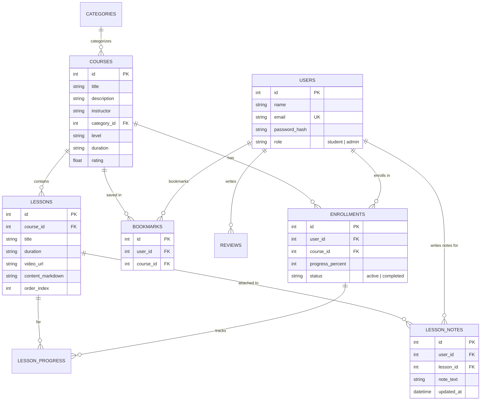

# 🎓 Coursify — Online Course Management System (Project 2)

A production-grade, human-crafted full-stack **Online Course Management System (E-Learning Platform)** engineered for final project evaluations, technical vivas, and placements. 

Developed by **Dhanush** with role-based access control (**Student** & **Admin**), searchable course catalog, video classroom with interactive progress tracking, in-lesson personal study scratchpad, concept-check quizzes, course wishlist bookmarks, verified completion certificates, course management CRUD, and an interactive REST API explorer.

---

## ⚡ 1-Minute Quick Start (Local Run)

### 1. Prerequisites
- **Node.js** (v18 or higher) & **npm**

### 2. Install & Start
```bash
# 1. Install all dependencies (root, backend, frontend)
npm run install:all

# 2. Run both backend (port 5000) & frontend (port 3000) concurrently
npm run dev
```

Visit the app in your browser: **[http://localhost:3000](http://localhost:3000)**.

---

## 🔑 Pre-Configured Demo Accounts

| Role | Name | Email | Password | Access Capabilities |
|---|---|---|---|---|
| **👨‍🎓 Student** | **Dhanush** | `dhanush@gmail.com` | `Student@123` | Browse catalog, bookmark wishlist, take personal study notes, complete quizzes, claim verifiable certificates |
| **👨‍💼 Admin** | **Admin Master** | `admin@coursify.com` | `Admin@123` | View analytics, create/edit/delete courses, monitor student progress, toggle user roles |

> 💡 **1-Click Demo Login**: Click the **"⚡ Demo Student"** or **"⚡ Demo Admin"** buttons in the navigation bar to login instantly without typing!

---

## 🌟 Standout "Human-Crafted" Features

1. **Interactive Video Classroom**:
   - 16:9 responsive video player with markdown code references.
   - **My Study Scratchpad**: Students can write and auto-save personal notes per lesson into the database.
   - **Knowledge Check Quiz**: Instant concept-check multiple-choice questions with answer explanations.
   - **Live Progress Engine**: Toggleable lesson checkboxes that dynamically recalculate percentage (`25% → 50% → 75% → 100%`) and trigger confetti celebrations on completion.
2. **Verifiable Certificates**:
   - High-resolution modal certificate issued to **Dhanush** with a verification ID and printable PDF styling.
3. **Course Wishlist / Bookmarking**:
   - Save favorite courses with instant bookmarking to a dedicated dashboard wishlist tab.
4. **Administrator Suite**:
   - Platform KPI summary (Total Students, Active Courses, Enrollments, Average Progress).
   - Course Management CRUD with multi-module syllabus builders.
   - Real-time student progress monitor table.
5. **Interactive REST API Explorer**:
   - `/api-docs` page with live endpoint execution directly in the browser.

---

## 🏗️ Architecture & Technology Stack

```text
Browser (Student / Admin)
         ↓  (JWT Bearer Authorization in HTTP Headers)
Frontend: React 18 + Vite + Vanilla CSS Glassmorphism Design System
         ↓  (REST API JSON Requests)
Backend:  Node.js + Express.js (MVC Pattern, JWT Auth, bcryptjs)
         ↓  (Prepared Statements)
Database: Relational SQLite (better-sqlite3 with WAL mode) / MySQL & PostgreSQL DDL Ready
```

- **Frontend**: React 18, Vite, `lucide-react`, `canvas-confetti`, Custom Vanilla CSS tokens (Dark theme, glassmorphism, responsive grid).
- **Backend**: Node.js, Express.js, `jsonwebtoken`, `bcryptjs`, `better-sqlite3`, `cors`, `morgan`.
- **Database Schema**: Relational database DDL available in [`server/schema.sql`](file:///c:/Users/141dh/OneDrive%20-%20Sri%20Venkateshwara%20College%20of%20engineering/Documents/project%202%20for%20congervence/server/schema.sql).

---

## 🗄️ Relational Database Schema



---

## 🔗 REST API Endpoints

### 🔐 Authentication (`/api/auth`)
- `POST /api/auth/register` — Register student or admin account
- `POST /api/auth/login` — Login with email/password, returns JWT token + user profile
- `GET /api/auth/me` — Fetch current user profile (Bearer JWT)

### 📚 Courses & Wishlist (`/api/courses`)
- `GET /api/courses` — Search, filter by category/level, and sort courses
- `GET /api/courses/categories` — List all categories with course counts
- `GET /api/courses/my/bookmarks` — List logged-in student's saved wishlist courses
- `POST /api/courses/:id/bookmark` — Toggle save/remove course from wishlist
- `GET /api/courses/:id` — Course syllabus, instructor info, and reviews
- `POST /api/courses` *(Admin)* — Create course with syllabus
- `PUT /api/courses/:id` *(Admin)* — Update course details
- `DELETE /api/courses/:id` *(Admin)* — Delete course & cascade data

### 🎓 Classroom & Notes (`/api/enrollments`)
- `POST /api/enrollments` — Enroll current user in a course
- `GET /api/enrollments/my` — Get student dashboard with progress stats
- `GET /api/enrollments/courses/:courseId/learn` — Get classroom video & modules
- `POST /api/enrollments/courses/:courseId/lessons/:lessonId/complete` — Toggle lesson complete
- `GET /api/enrollments/lessons/:lessonId/notes` — Get student's private lesson notes
- `POST /api/enrollments/lessons/:lessonId/notes` — Save student's private lesson notes

### 🛡️ Admin Suite (`/api/admin`)
- `GET /api/admin/stats` — Platform analytics overview
- `GET /api/admin/enrollments` — All student enrollment records
- `GET /api/admin/users` — User directory with role status
- `PUT /api/admin/users/:id/role` — Promote/demote student or admin

---

## 🚀 Step-by-Step Deployment Guide (Free)

### Method 1: Deploy on Render.com (Recommended - Single Unified Full-Stack Service)

1. **Push your code to GitHub**:
   ```bash
   git init
   git add .
   git commit -m "Initial commit: Coursify Full-Stack App by Dhanush"
   git branch -M main
   git remote add origin https://github.com/YOUR_USERNAME/coursify.git
   git push -u origin main
   ```
2. **Create a Free Web Service on Render**:
   - Go to [render.com](https://render.com) and log in with your GitHub.
   - Click **New +** → **Web Service**.
   - Select your `coursify` repository.
   - Set the following settings:
     - **Name**: `coursify-app`
     - **Runtime**: `Node`
     - **Build Command**: `npm run build`
     - **Start Command**: `npm run start`
   - Under **Environment Variables**, add:
     - `PORT`: `5000`
     - `JWT_SECRET`: `coursify_production_jwt_secret_dhanush_2026`
     - `NODE_ENV`: `production`
   - Click **Create Web Service**. Render will automatically build the frontend, package the database, and launch your live site!

---

## 💡 Placement Viva & Technical Interview Answers

> **Q: Why did you choose Express and React for this system?**  
> *"I chose React with Vite on the frontend for declarative UI rendering, fast Hot Module Replacement, and modular state management with Context API. On the backend, Express.js provides a lightweight, non-blocking asynchronous REST architecture with middleware for JWT authentication and role-based access control."*

> **Q: How are passwords protected and tokens handled?**  
> *"Passwords are salted and hashed using bcryptjs (10 salt rounds) before database insertion. On authentication, a signed JSON Web Token is generated containing the user's ID, email, and role. The client includes this token in the `Authorization: Bearer <token>` header for subsequent authorized requests."*

> **Q: How does the progress recalculation engine prevent duplicate or inconsistent progress?**  
> *"Progress is computed server-side to prevent tampering. When a student toggles a lesson checkbox, the backend updates the `lesson_progress` table and runs an aggregate query `(completed_lessons / total_lessons) * 100`. The resulting percentage is updated in the `enrollments` table. If it reaches 100%, the enrollment status shifts from `active` to `completed`, automatically authorizing certificate generation."*
